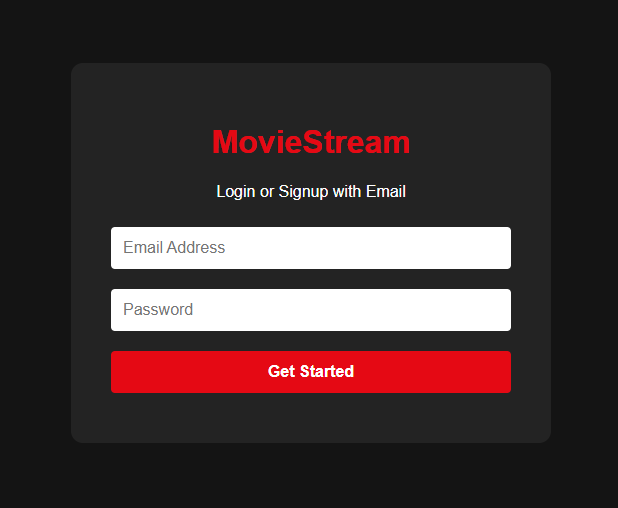
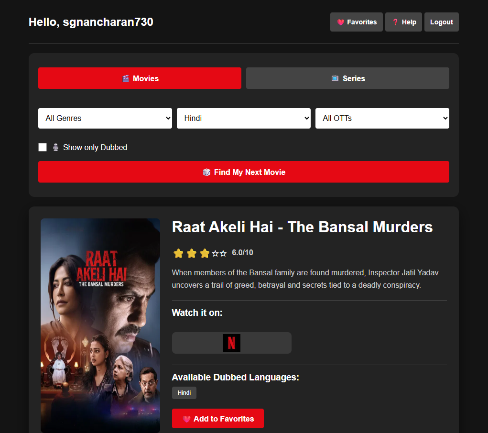
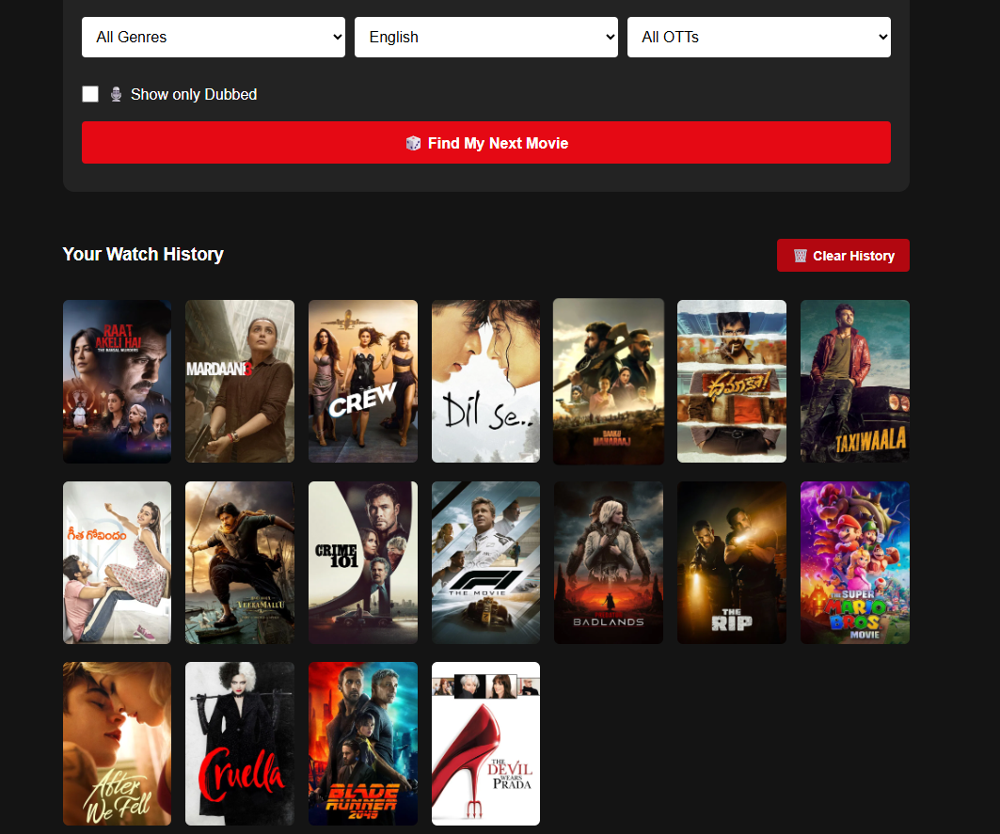

# 🎬 MovieStream - Random Movie Finder

[](https://opensource.org/licenses/MIT)
[](https://html.spec.whatwg.org/)
[](https://www.javascript.com/)
[](https://firebase.google.com/)


## 📋 Table of Contents

- [Overview](#overview)
- [Features](#features)
- [Tech Stack](#tech-stack)
- [Prerequisites](#prerequisites)
- [Installation](#installation)
- [Configuration](#configuration)
  - [Firebase Setup](#firebase-setup)
  - [TMDB API Setup](#tmdb-api-setup)
- [Usage](#usage)
- [How It Works](#how-it-works)
- [Supported Languages & Platforms](#supported-languages--platforms)
- [Responsive Design](#responsive-design)
- [Project Structure](#project-structure)
- [Contributing](#contributing)
- [License](#license)
- [Acknowledgments](#acknowledgments)

---

## 🎯 Overview

**MovieStream** is an intelligent movie and TV series discovery application that helps users find entertainment content based on their preferences. It integrates with real-time streaming availability data to show users where they can watch content, with support for multiple languages and dubbed versions.

Whether you're a casual viewer looking for something new or an avid film enthusiast seeking specific genres and languages, MovieStream simplifies the discovery process with personalized recommendations and comprehensive filtering options.

---

## ✨ Features

### 🎲 Smart Discovery
- **Random Movie/Series Finder**: Discover new content with a single click
- **Smart Filtering**: Search by genre, language, and OTT platforms
- **Dubbed Content Filter**: Find movies and shows dubbed in your preferred language
- **OTT Platform Integration**: Display 24+ streaming platforms

### 🌍 Multi-Language Support
- **Indian Languages**: Hindi, Telugu, Tamil, Kannada, Malayalam, Marathi, Punjabi, Bengali, Gujarati, Odia, Urdu
- **International Languages**: English, Spanish, Korean
- **Dubbed Version Detection**: See which dubbed versions are available for each title

### 📺 Comprehensive Content Library
- **Movies & Series Tabs**: Switch between movies and TV series
- **24+ OTT Platforms**: Netflix, Amazon Prime Video, Disney+, Hotstar, ZEE5, SonyLiv, and more
- **Genre-Based Search**: Filter from 20+ genres
- **Real-Time Streaming Data**: Updated availability from TMDB

### ⭐ Rating System
- **Visual Star Ratings**: 5-star display for quick quality assessment
- **IMDB Scores**: Exact rating out of 10
- **Informed Decisions**: Choose content based on ratings and reviews

### 📚 Watch History Management
- **Persistent History**: Your watch history is securely stored
- **Quick Access**: Click on any history item to view full details
- **User-Specific**: Each account has independent history
- **Clear History**: One-click option to reset your history

### 👤 User Authentication
- **Firebase Authentication**: Secure Email/Password login
- **Account Isolation**: Separate watch history for each user
- **Seamless Experience**: Auto-login with persistent sessions

### 📱 Fully Responsive Design
- **Desktop Optimized**: Perfect on large screens
- **Tablet Compatible**: Adaptive layout for 768px+ screens
- **Mobile-Friendly**: Optimized for all phone sizes (480px+)
- **Touch-Optimized**: Responsive buttons and interactive elements

---

## 📸 Interface Preview


| 🔐 Secure Authentication | 🎲 Smart Movie Finder |
|:---:|:---:|
|  |  |
| *Firebase Identity Management* | *Genre & Language Filtering* |

| 📜 Persistent Watch History |
|:---:|
|  |
| *Cloud-Synced NoSQL Storage (Never see the same movie twice)* |

---

## 🛠 Tech Stack

### Frontend
- **HTML5**: Semantic markup and structure
- **CSS3**: Advanced styling with media queries and flexbox
- **JavaScript (ES6+)**: Modern JavaScript with async/await

### Backend & Services
- **Firebase Authentication**: Secure user authentication
- **Firestore Database**: Real-time cloud database for user history
- **TMDB API**: The Movie Database API for movie/series data and streaming info

### Infrastructure
- **Responsive Design**: Mobile-first approach with CSS media queries
- **CDN-Hosted Libraries**: Firebase SDKs via Google CDN

---

## 📋 Prerequisites

Before you begin, ensure you have the following:

1. **Web Browser**: Modern browser supporting ES6 (Chrome, Firefox, Safari, Edge)
2. **Internet Connection**: Required for API calls and Firebase
3. **Firebase Account**: Free tier available at [firebase.google.com](https://firebase.google.com)
4. **TMDB API Key**: Free key from [themoviedb.org](https://www.themoviedb.org/settings/api)
5. **Text Editor**: VS Code, Sublime Text, or any code editor

---

## 📦 Installation

### 1. Clone or Download the Repository

```bash
git clone https://github.com/sgnancharan/moviestream.git
cd moviestream
```

Or download the `index.html` file directly.

### 2. No Build Process Required

This is a standalone single-file application. No installation of dependencies needed!

### 3. Serve the Application

For local development, you can:

**Option A: Using Python**
```bash
# Python 3
python -m http.server 8000

# Python 2
python -m SimpleHTTPServer 8000
```

**Option B: Using Node.js**
```bash
npx http-server
```

**Option C: Using Live Server (VS Code)**
- Install the "Live Server" extension in VS Code
- Right-click on `index.html` and select "Open with Live Server"

**Option D: Direct File Access**
- Simply open `index.html` in your browser (⚠️ Some features may not work with local file:// protocol)

---

## ⚙️ Configuration

### Firebase Setup

1. **Create Firebase Project**
   - Go to [Firebase Console](https://firebase.google.com)
   - Click "Add Project"
   - Follow the setup wizard

2. **Enable Authentication**
   - In Firebase Console, go to Authentication
   - Click "Get Started"
   - Enable "Email/Password" provider

3. **Setup Firestore Database**
   - Go to "Firestore Database" section
   - Click "Create database"
   - Choose "Start in production mode"
   - Set security rules:

```javascript
rules_version = '2';
service cloud.firestore {
  match /databases/{database}/documents {
    match /users/{userId} {
      allow read, write: if request.auth.uid == userId;
    }
  }
}
```

4. **Get Firebase Config**
   - In Project Settings, scroll to "Your apps"
   - Copy the Firebase config object
   - Replace the `firebaseConfig` in the HTML file:

```javascript
const firebaseConfig = {
  apiKey: "YOUR_API_KEY",
  authDomain: "YOUR_AUTH_DOMAIN.firebaseapp.com",
  projectId: "YOUR_PROJECT_ID",
  storageBucket: "YOUR_STORAGE_BUCKET.appspot.com",
  messagingSenderId: "YOUR_MESSAGING_SENDER_ID",
  appId: "YOUR_APP_ID"
};
```

### TMDB API Setup

1. **Create TMDB Account**
   - Visit [themoviedb.org/signup](https://www.themoviedb.org/signup)
   - Create a free account

2. **Get API Key**
   - Go to [Settings → API](https://www.themoviedb.org/settings/api)
   - Copy your API key (v3 auth token)

3. **Configure in Code**
   - In `index.html`, find the `TMDB_KEY` variable
   - Replace with your API key:

```javascript
const TMDB_KEY = 'YOUR_TMDB_API_KEY_HERE';
```

---

## 🚀 Usage

### Getting Started

1. **Open the Application**
   - Navigate to `index.html` in your browser
   - You'll see the login/signup screen

2. **Create Account or Login**
   - Enter your email and password
   - Click "Get Started"
   - Account is automatically created if new

3. **Discover Content**
   - Select tab: **🎬 Movies** or **📺 Series**
   - Choose language from dropdown
   - (Optional) Select OTT platform
   - (Optional) Select genre
   - (Optional) Check "Show only Dubbed" for dubbed content
   - Click **🎲 Find My Next Movie**

4. **View Details**
   - See poster, title, and description
   - Check available streaming platforms
   - View dubbed language versions
   - See IMDB rating

5. **Manage History**
   - Click any history item to view full details
   - Use "🗑️ Clear History" button to reset

6. **Logout**
   - Click the Logout button
   - All filters reset for security

### Example Workflows

**Finding Telugu Dubbed Movies on Netflix:**
1. Go to Movies tab
2. Select "Telugu" language
3. Select "Netflix" in OTT dropdown
4. Check "Show only Dubbed"
5. Click "Find My Next Movie"

**Exploring Popular Series:**
1. Go to Series tab
2. Select your preferred language
3. (Leave OTT as "All OTTs")
4. Click "Find My Next Series"

---

## 🔧 How It Works

### Architecture Overview

```
┌─────────────────────────────────────────┐
│         User Interface (HTML/CSS)        │
├─────────────────────────────────────────┤
│       JavaScript Logic (ES6+)            │
├─────────────────────────────────────────┤
│   Firebase SDK    │    TMDB API SDK      │
├─────────────────────────────────────────┤
│ Authentication   │  Movie Data & Info    │
│ Firestore DB     │  Streaming Providers  │
└─────────────────────────────────────────┘
```

### Data Flow

1. **Initialization**
   - Load Firebase SDK and TMDB API
   - Check authentication state

2. **User Discovery**
   - User selects filters and clicks "Find"
   - App queries TMDB API for movies/series
   - Filters by language, genre, OTT availability
   - Checks for dubbed versions if enabled

3. **Display Results**
   - Fetches detailed movie info from TMDB
   - Gets OTT provider logos
   - Retrieves available dubbed languages
   - Displays everything to user

4. **History Management**
   - When user finds a movie, stores in Firestore
   - Associated with user's unique UID
   - Can be retrieved and clicked to view details
   - Can be cleared by user

---

## 🌐 Supported Languages & Platforms

### Languages
| Language | Code |
|----------|------|
| English | en |
| Hindi | hi |
| Telugu | te |
| Tamil | ta |
| Kannada | kn |
| Malayalam | ml |
| Marathi | mr |
| Punjabi | pa |
| Bengali | bn |
| Gujarati | gu |
| Odia | or |
| Urdu | ur |
| Spanish | es |
| Korean | ko |

### Streaming Platforms (24+)

**Major Streaming:**
- Netflix
- Amazon Prime Video
- Disney+
- Hulu
- HBO Max
- Apple TV+
- Paramount+
- Peacock
- YouTube

**Indian OTTs:**
- Hotstar
- ZEE5
- SonyLiv
- Voot
- MX Player
- Jio Cinema

**International:**
- WeTV
- Rakuten Viki
- iQiyi
- Bilibili
- MUBI
- Criterion Channel
- BritBox
- Acorn TV

---

## 📱 Responsive Design

App adapts seamlessly across all devices:

| Device | Screen Size | Optimization |
|--------|------------|--------------|
| Desktop | 1024px+ | Full layout, large cards |
| Tablet | 768px - 1024px | Adjusted spacing and sizing |
| Mobile | 600px - 768px | Stacked layout, compact UI |
| Small Mobile | 480px - 600px | Minimal spacing, optimized fonts |
| Very Small | <480px | Ultra-compact, full-width elements |

---

## 📂 Project Structure

```
moviestream/
├── index.html                 # Single-file application
├── README.md                  # This file
└── LICENSE                    # MIT License
```

### File Overview

**index.html** (Single file containing):
- HTML Structure
- CSS Styling (with media queries)
- JavaScript Logic (ES6+ modules)
- Firebase integration
- TMDB API integration

---

## 🤝 Contributing

We welcome contributions! Here's how you can help:

### 1. Report Bugs
- Open an issue with clear description
- Include steps to reproduce
- Mention your browser and OS

### 2. Suggest Features
- Create an issue with "Feature Request" label
- Describe use case and expected behavior

### 3. Submit Code Changes
1. Fork the repository
2. Create a feature branch: `git checkout -b feature/AmazingFeature`
3. Make your changes
4. Commit: `git commit -m 'Add AmazingFeature'`
5. Push: `git push origin feature/AmazingFeature`
6. Open a Pull Request

### Guidelines
- Keep code clean and well-commented
- Test on mobile and desktop
- Follow existing code style
- Update README if needed

---

## 📄 License

This project is licensed under the MIT License - see the [LICENSE](LICENSE) file for details.

**MIT License Summary:**
- ✅ Commercial use allowed
- ✅ Modification allowed
- ✅ Distribution allowed
- ✅ Private use allowed
- ⚠️ Include license and copyright notice

---

## 🙏 Acknowledgments

### APIs & Services
- **TMDB (The Movie Database)**: For comprehensive movie and series data
- **Firebase**: For authentication and cloud database services
- **Google**: For Firebase CDN and services

### Inspiration & Tools
- Netflix-inspired UI design
- Movie discovery concept
- Real-time streaming data integration

### Community
- Thanks to all contributors and testers
- Special thanks to users providing feedback

---

## 📞 Support & Contact

- **Report Issues**: [Create an Issue](https://github.com/yourusername/moviestream/issues)
- **Feature Requests**: [Discussions](https://github.com/yourusername/moviestream/discussions)
- **Email**: your.email@example.com

---

## 🚦 Roadmap

### Planned Features
- [ ] Social sharing of recommended movies
- [ ] User reviews and ratings
- [ ] Watchlist/Favorites
- [ ] Advanced search filters
- [ ] Movie trailer integration
- [ ] Multiple language UI
- [ ] Dark/Light theme toggle
- [ ] PWA (Progressive Web App) support
- [ ] Browser notifications

### Under Consideration
- Desktop app (Electron)
- Mobile apps (React Native)
- Advanced analytics
- Recommendation algorithm improvements

---

## 📊 Statistics

- **Supported Languages**: 14+
- **Streaming Platforms**: 24+
- **Movie Genres**: 20+
- **Database**: 500,000+ titles
- **Response Time**: < 2 seconds
- **User Capacity**: Unlimited (Firebase scalable)

---

## ⭐ Show Your Support

If you find MovieStream helpful, please:
- ⭐ Star this repository
- 🐦 Share with friends
- 📝 Leave feedback
- 🤝 Contribute improvements

---

**Made with ❤️ for movie lovers everywhere**
